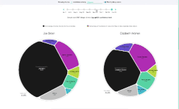

# WORK IN PROGRESS

# d3-voronoi-map-tween

This D3 plugin allows to animate back and forth between two [d3-voronoi-map](https://github.com/Kcnarf/d3-voronoi-map).

Considering the data coming from either the starting data set or the ending data set, each single datum has a corresponding cell in the starting Voronoï map and another in the ending Voronoï map. The objective of the plugin is to provide a way (i.e. an interpolator function) to smoothly interpolate between the starting cell and the ending cell of each data.

To do so, the algorithm does not interpolate polygons associated to each single datum in order to no have a mess of overlapping cells (cf. [this easy-but-unsatisfying attempt](https://bl.ocks.org/Kcnarf/5d4f70d906bc2cc84cd8d7b2559a49c0)). But it rather interpolates the characteristics of the sites producing each polygon and then compute a Voronoï map of these interpolated sites (thanks to [d3-weighted-voronoi](https://github.com/Kcnarf/d3-weighted-voronoi)). It also takes care of cells found only in the starting Voronoï map (data only available in the starting data set) or found only in the ending Voronoï map (data only in the ending data set).

Because a picture is worth a thousand words:


In this animation:

- <span style="color:steelblue">blue</span> cells are cells available in both the starting and ending Voronoï maps, i.e. data both in the starting and ending sets; these cells smoothly evolve in order to reflect their starting and ending weights, which may be distinct
- <span style="color:pink">red </span>cells are cells available only in the starting Voronoï map, i.e. data only in the starting data set; these cells smoothly disappear
- <span style="color:lightgreen">green</span> cells are cells available only in the ending Voronoï map, i.e. data only in the ending data set; these cells smoothly appear
- _'evolving overall size'_ demonstrates that the plugin can handle animation between disks of distinct sizes; when enabled, the ending overall disk is smaller than the starting disk
- _'evolving overall shape'_ demonstrates that the plugin can handle animation between distinct shapes; when enabled, the ending overall shape is a pentagone; here, the smooth interpolation between the two shapes (circle and pentagon) is handled with [flubber](https://github.com/veltman/flubber)
- _'show internals'_ shows how the cells' sites evolve (they either appear/disappear/evolve in location and weight)

Available only for **d3-voronoi-map v2**.

## Context

Animating a Voronoï map is already possible with the [live arrangement](https://github.com/Kcnarf/d3-voronoi-map#live) feature of the [d3-voronoi-map](https://github.com/Kcnarf/d3-voronoi-map) plugin. This feature is sufficient to handle updates of data (displayed as evolving cell areas) for a static overall shape, but can't handle addition or deletion of data (deletion = data no longer existing at the end of the animation, addition = data not existing at the begining of the animation) and can't handle an evolving overall shape (e.g. a shape becoming bigger, representing the increase of the total amount).

This is where the d3-voronoi-map-tween comes in:

- added data are displayed as new and emmerging cells
- deleted data are displayed as shrinking and removed cells
- evolving overall shape is possible

## Examples

- Real life use cases

  - [Democratic Primaries: Preferential Poll Results](https://swayable.com/insights/primaries2019) by Nadieh Bremer for Swayable (more details at https://www.visualcinnamon.com/portfolio/swayable-preferential-polling); in reality, this real life use case does not use the plugin, but it was the premice of this plugin  
    

- Examples with available code
  - [d3-voronoi-map-tween usage](https://bl.ocks.org/Kcnarf/bbd5f4811af948badb161accbaace61e)

## Installing

<!--If you use NPM, `npm install d3-voronoi-map-tween`. Otherwise, load `https://rawcdn.githack.com/Kcnarf/d3-voronoi-map-tween/v0.0.1/build/d3-voronoi-treemap.js` --> Load `https://raw.githack.com/Kcnarf/d3-voronoi-map-tween/master/build/d3-voronoi-map-tween.js` (or its `d3-voronoi-map-tween.min.js` version) to make it available in AMD, CommonJS, or vanilla environments. In vanilla, you must load the [d3-weighted-voronoi](https://github.com/Kcnarf/d3-weighted-voronoi) and [d3-voronoi-map](https://github.com/Kcnarf/d3-voronoi-map) plugins prior to this one, and a d3 global is exported:

```html
<script src="https://d3js.org/d3.v6.min.js"></script>
<script src="https://rawcdn.githack.com/Kcnarf/d3-weighted-voronoi/v1.1.3/build/d3-weighted-voronoi.js"></script>
<script src="https://rawcdn.githack.com/Kcnarf/d3-voronoi-map/v2.1.1/build/d3-voronoi-map.js"></script>
<script src="https://rawcdn.githack.com/Kcnarf/d3-voronoi-treemap/v0.0.1/build/d3-voronoi-map-tween.js">
  <script>
    var voronoiMapTween = d3.voronoiMapTween();
</script>
```

<!--
If you're interested in the latest developments, you can use the master build, available throught:

```html
<script src="https://raw.githack.com/Kcnarf/d3-voronoi-treemap/master/build/d3-voronoi-treemap.js"></script>
```
-->

## TL;DR;

In your javascript, in order to define the tween:

```javascript
var startingVoronoiMapSimulation = d3.voronoiMapSimulation(startingData);
goToFinalState(startingVoronoiMapSimulation); // get the most representative Voronoï map, using d3-voronoi-map's *static* computation feature
var endingVoronoiMapSimulation = d3.voronoiMapSimulation(endingData);
goToFinalState(endingVoronoiMapSimulation); // get the most representative Voronoï map, using d3-voronoi-map's *static* computation feature

var voronoiMapTween = d3.voronoiMapTween(startingVoronoiMapSimulation, endingVoronoiMapSimulation);
var voronoiMapInterpolator = voronoiMapTween.mapInterpolator(); // interpolator of the Voronoi maps
```

Then, later in your javascript, in order to compute the interpolated Voronoï map cells, set the desired interpolation value (within `[0, 1]`):

```javascript
var interpolatedVoronoiMapCells = voronoiMapTween(0.5); // basic use case, returns a set of polygons/cells
var startingVoronoiMapCells = voronoiMapTween(0); // at 0, similar to startingVoronoiMap.state().polygons
var endingVoronoiMapCells = voronoiMapTween(1); // at 1, similar to endingVoronoiMap.state().polygons
```

## API

<a name="voronoiMapTween" href="#voronoiMapTween">#</a> d3.<b>voronoiMapTween</b>(<i>startingVoronoiMapSimluation</i>, <i>endingVoronoiMapSimluation</i>)

Creates a new voronoiMapTween based on the two [d3-voronoi-map](https://github.com/Kcnarf/d3-voronoi-map) simulations, and with the default configuration values and functions ([_startingKey_](#voronoiMapTween_startingKey), [_endingKey_](#voronoiMapTween_endingKey), [_clipInterpolator_](#voronoiMapTween_clipInterpolator)).

<a name="voronoiMapTween_mapInterpolator" href="#voronoiMapTween_mapInterpolator">#</a> <i>voronoiMapTween</i>.<b>mapInterpolator</b>()

Returns a function which is the interpolator between the starting Voronoï map and the ending Voronoï map. Calling _mapInterpolator(interpolationValue)_ returns a Voronoï map, which is a sparse array of polygons, one for each data coming from either the starting data set or the ending data set. The _interpolation value_ must be a float value within `[0, 1]`:

- `mapInterpolator(0)` returns a Voronoï map _similar\*_ to `startingVoronoiMapSimluation.state().polygons`; _similar\*_ means same polygons, but not necessarily in the same order; there is no polygon for data exclusively in the <i>endingVoronoiMapSimluation</i>
- `mapInterpolator(1)` returns a Voronoï map _similar\*_ to `endingVoronoiMapSimluation.state().polygons`; there is no polygon for data exclusively in the <i>startingVoronoiMapSimluation</i>
- else, returns an intermediate Voronoï map inbetween the starting and ending Voronoï maps for any other value within `]0,1[`

For each computed polygon `p`, `p.site.originalObject` gives access to the interpolated site and its caracteristics:

- `p.site.originalObject.key` is the key, retrieved from either [_startingKey_](#voronoiMapTween_startingKey) or [_endingKey_](#voronoiMapTween_endingKey), and which allows to make the correspondance between starting and ending data
- `p.site.originalObject.interpolatedX` and `p.site.originalObject.interpolatedY` are its interpolate coordinates
- `p.site.originalObject.interpolatedDataWeight` is the interpolated weight of the underlying data
- `p.site.originalObject.tweenType`, in `[ENTER_TWIN_TYPE, UPDATE_TWEEN_TYPE, EXIT_TWEEN_TYPE]`, defines if the site handles a entering/updating/exiting data
- `p.site.originalObject.startingData` and `p.site.endingData` reference the starting and ending data; one of the two references may be null if the site corresponds to a datum only available in the starting data set or only in the ending data set

<a name="voronoiMapTween_startingKey" href="#voronoiMapTween_startingKey">#</a> <i>voronoiMapTween</i>.<b>startingKey</b>([<i>key</i>])

In order to make the correspondance between the starting and ending cells of a single datum, each starting cell is assigned a key, retrieved from its underlying datum throught the starting _key_ accessor. The starting key accessor and the ending key accessor may be distincts.

If _key_ is specified, sets the _key_ accessor, which must be a function accepting a parameter wich reference a datum (i.e. a element of the starting data set used to compute the starting Voronoï map). If _key_ is not specified, returns the current _key_ accessor, which defaults to:

```js
function key(d) {
  return d.id;
}
```

<a name="voronoiMapTween_endingKey" href="#voronoiMapTween_endingKey">#</a> <i>voronoiMapTween</i>.<b>endingKey</b>([<i>key</i>])

Same as [_startingKey_](#voronoiMapTween_startingKey), but for the ending cells.

<a name="voronoiMapTween_clipInterpolator" href="#voronoiMapTween_clipInterpolator">#</a> <i>voronoiMapTween</i>.<b>clipInterpolator</b>([<i>ƒ</i>])

If _ƒ_ is specified, sets the clipping polygon interpolator. If _ƒ_ is not specified, returns the current interpolator, which defaults to:

```js
function ƒ(interpolationValue) {
  return startingVoronoiMapSimulation.clip();
}
```

By default, we consider the starting and ending Voronoï maps having the same clipping polygon (thus, the default _clipInterpolator_ interpolates nothing ;-). When the clipping polygon evolves, this API should be used to provide the clipping polygon interpolator, which must be a function ƒ accepting a float parameter in `[0, 1]` where:

- `ƒ(0)` returns the starting clipping polygon
- `ƒ(1)` returns the ending clipping polygon
- else returns an intermediate polygon inbetween the satrting and ending polygon for any other value within `]0,1[`

As a simple first example, if the starting and ending clipping polygons are squares of different sizes, the _clipInterpolator_ may look like:

```js
const startingSize = 50;
const endingSize = 100;
function ƒ(interpolationValue) {
  const intermediateSize = (1 - interpolationValue) * startingSize + interpolationValue * endingSize; // lerp interpolation
  return [
    [0, 0],
    [0, intermediateSize],
    [intermediateSize, intermediateSize],
    [intermediateSize, 0],
  ];
}
// f(0) returns [[0,0], [0,50], [50,50], [50,0]]
// f(1) returns [[0,0], [0,100], [100,100], [100,0]]
// f(0.5) returns [[0,0], [0,75], [75,75], [75,0]]
voronoiMapTween.clipInterpolator(ƒ);
```

Note: if the starting and ending clipping polygons are of the same kind (e.g. a square, a disc) but with distinct sizes (as in the above example), you can try to use a static clipping polygon, and then <em>scale</em> the svg/paths.

As a second example, for more complexe use cases where the starting and ending shapes are not of the same kind (e.g. a circle and a pentagon), you can provide a _clipInterpolator_ using [flubber](https://github.com/veltman/flubber):

```js
const startingClippingPolygon = [...]; // an array of 2D points, ordered counterclockwise, defining a convex shape
const endingClippingPolygon = [...]; // another array of 2D points
const ƒ = flubber.interpolate(startingClippingPolygon, endingClippingPolygon, {string: false}); // {string:false} produces an array of 2D points

voronoiMapTween.clipInterpolator(ƒ);
```

## Dependencies

- d3-voronoi-map.voronoiMapSimulation

## Semantic Versioning

d3-voronoi-map-tween attempts to follow [semantic versioning](https://semver.org) and bump major version only when backward incompatible changes are released.
