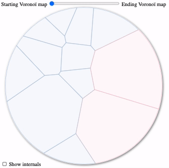

# WORK IN PROGRESS

# d3-voronoi-map-tween

This D3 plugin allows to interpolate from one [d3-voronoi-map](https://github.com/Kcnarf/d3-voronoi-map) to another.

Considering the data comming from either the starting data set or the ending data set, each single datum has a corresponding cell in the starting Voronoï map and another in the ending Voronoï map. The objective of the plugin is to provide a way (i.e. an interpolator function) to smoothly interpolate between the starting cell and the ending cell of each data. To do so, we do not interpolate polygons associated to each single datum in order to no have a mess of overlapping polygons. But we rather interpolate the characteristics of the sites of each polygon and then compute a Voronoï map of these interpolated sites (thanks to [d3-weighted-voronoi](https://github.com/Kcnarf/d3-weighted-voronoi)). We also have to take care of data only available in the starting or ending data sets.

Because a picture is worth a thousand words:



In this animation:

- blue cells are cells available in both the starting and ending Voronoï map, i.e. data both in the starting and ending sets; these cells smoothly evolve in order to reflect their starting and ending weights, which may be distinct
- red cells are cells available only in the starting Voronoï map, i.e. data only in the starting data set; these cells smoothly disappear
- green cells are cells available only in the ending Voronoï map, i.e. data only in the ending data set; these cells smoothly appear
- the second half part of the animation shows how the cells' sites evolve (they either appear/disappear/evolve in location and weight)

Available only for **d3-voronoi-map v2**.

## Context

Animating a Voronoï map is already possible with the [live arrangement](https://github.com/Kcnarf/d3-voronoi-map#live) feature of the [d3-voronoi-map](https://github.com/Kcnarf/d3-voronoi-map) plugin. This feature is suffisant to handle updates of data (displayed as evolving cell areas) for a static overall shape, but can't handle addition or deletion of data (deletion = data no longer existing at the end of the animation, addition = data not existing at the begining of the animation) and can't handle an evolving overall shape (e.g. a shape being bigger as the total amount it represents increases).

This is where the d3-voronoi-map-tween comes in:

- added data are displayed as new and emmerging cells
- deleted data are displayed as shrinking and removed cells
- evolving overall shape is possible

## Examples

- Real life use cases
  - [Democratic Primaries: Preferential Poll Results](https://swayable.com/insights/primaries2019) by Nadieh Bremer in Swayable (more details at https://www.visualcinnamon.com/portfolio/swayable-preferential-polling); in reality, this real life use case does not use the plugin, but it was the premice of this plugin
- Examples with available code
  - [Voronoï playground: animating addition/removing of data](https://blockbuilder.org/Kcnarf/b2212ceafc875aac0e02a153fe9ff330)

## Installing

<!--If you use NPM, `npm install d3-voronoi-map-tween`. Otherwise, load `https://rawcdn.githack.com/Kcnarf/d3-voronoi-map-tween/v0.0.1/build/d3-voronoi-treemap.js`--> Load `https://raw.githack.com/Kcnarf/d3-voronoi-map-tween/master/build/d3-voronoi-map-tween.js`(or its `d3-voronoi-map-tween.min.js` version) to make it available in AMD, CommonJS, or vanilla environments. In vanilla, you must load the [d3-weighted-voronoi](https://github.com/Kcnarf/d3-weighted-voronoi) and [d3-voronoi-map](https://github.com/Kcnarf/d3-voronoi-map) plugins prior to this one, and a d3 global is exported:

```html
<script src="https://d3js.org/d3.v6.min.js"></script>
<script src="https://rawcdn.githack.com/Kcnarf/d3-weighted-voronoi/v1.0.1/build/d3-weighted-voronoi.js"></script>
<script src="https://rawcdn.githack.com/Kcnarf/d3-voronoi-map/v2.0.1/build/d3-voronoi-map.js"></script>
<!--NO-VERSION-YET script src="https://rawcdn.githack.com/Kcnarf/d3-voronoi-treemap/v0.0.1/build/d3-voronoi-map-tween.js"></script-->
<script src="https://rawcdn.githack.com/Kcnarf/d3-voronoi-treemap/master/build/d3-voronoi-map-tween.js"></script>
<script>
  var voronoiMapTween = d3.voronoiMapTween();
</script>
```

<!--
If you're interested in the latest developments, you can use the master build, available throught:

```html
<script src="https://raw.githack.com/Kcnarf/d3-voronoi-treemap/master/build/d3-voronoi-treemap.js"></script>
```
-->

## TL;DR;

In your javascript, in order to define the tween:

```javascript
var startingVoronoiMapSimulation = d3.voronoiMapSimulation(startingData);
goToFinalState(startingVoronoiMapSimulation); // get the most representative Voronoï map, using d3-voronoi-map's static* computation feature
var endingVoronoiMapSimulation = d3.voronoiMapSimulation(endingData);
goToFinalState(endingVoronoiMapSimulation); // get the most representative Voronoï map, using d3-voronoi-map's static* computation feature

var voronoiMapTween = d3.voronoiMapTween(startingVoronoiMapSimulation, endingVoronoiMapSimulation);
var voronoiMapInterpolator = voronoiMapTween.mapInterpolator(); // interpolator of the Voronoi maps
```

Then, later in your javascript, in order to compute the interpolated Voronoï map cells, set the desired interpolation value (within `[0, 1]`):

```javascript
var interpolatedVoronoiMapCells = voronoiMapTween(0.5); // basic use case, returns a set of polygons/cells
var startingVoronoiMapCells = voronoiMapTween(0); // at 0, similar to startingVoronoiMap.state().polygons
var endingVoronoiMapCells = voronoiMapTween(1); // at 1, similar to endingVoronoiMap.state().polygons
```

## API

<a name="voronoiMapTween" href="#voronoiMapTween">#</a> d3.<b>voronoiMapTween</b>(<i>startingVoronoiMapSimluation</i>, <i>endingVoronoiMapSimluation</i>)

Creates a new voronoiMapTween based on the two [d3-voronoi-map](https://github.com/Kcnarf/d3-voronoi-map) simulations, and with the default configuration values and functions ([_startingKey_](#voronoiMapTween_startingKey), [_endingKey_](#voronoiMapTween_endingKey), [_clipInterpolator_](#voronoiMapTween_clipInterpolator)).

<a name="voronoiMapTween_mapInterpolator" href="#voronoiMapTween_mapInterpolator">#</a> <i>voronoiMapTween</i>.<b>mapInterpolator</b>()

Returns a function which is the interpolator between the starting Voronoï map and the ending Voronoï map. Calling _mapInterpolator(interpolationValue)_ returns a Voronoï map, which is a sparse array of polygons, one for each data comming from either the starting data set or the ending data set. The _interpolation value_ must be a float value within `[0, 1]`:

- `mapInterpolator(0)` returns a Voronoï map \_similar\*_ to `startingVoronoiMapSimluation.state().polygons`; \_similar\*_ means same polygons, but not necessarily in the same order; there is no polygon for data exclusively in the <i>endingVoronoiMapSimluation</i>
- `mapInterpolator(1)` returns a Voronoï map \_similar\*\_ to `endingVoronoiMapSimluation.state().polygons`; there is no polygon for data exclusively in the <i>startingVoronoiMapSimluation</i>
- else, returns an intermediate Voronoï map inbetween the starting and ending Voronoï maps for any other value within `]0,1[`

<a name="voronoiMapTween_startingKey" href="#voronoiMapTween_startingKey">#</a> <i>voronoiMapTween</i>.<b>startingKey</b>([<i>key</i>])

In oredr to make the correpondance between the starting and ending polygon of a single datum, we assigns each starting polygon/cell with their respective datum's key.

Starting and ending keys may be distinct. If _key_ is specified, sets the _key_ accessor. If _key_ is not specified, returns the current _key_ accessor, which defaults to:

```js
function key(d) {
  return d.id;
}
```

<a name="voronoiMapTween_endingKey" href="#voronoiMapTween_endingKey">#</a> <i>voronoiMapTween</i>.<b>endingKey</b>([<i>key</i>])

Same as [_startingKey_](#voronoiMapTween_startingKey), but for the ending polygons/cells.

<a name="voronoiMapTween_clipInterpolator" href="#voronoiMapTween_clipInterpolator">#</a> <i>voronoiMapTween</i>.<b>clipInterpolator</b>([<i>ƒ</i>])
If _ƒ_ is specified, sets the clipping polygon interpolator. If _ƒ_ is not specified, returns the current interpolator, which defaults to:

```js
function ƒ(interpolationValue) {
  return startingVoronoiMapSimulation.clip();
}
```

By default, we consider the starting and ending Voronoï maps having the same clipping polygon (thus, the default _clipInterpolator_ interpolates nothing ;-). When the clipping polygon evolves, this API should be used to provide the clipping polygon interpolator, which must be a function ƒ accepting a float parameter in `[0, 1]` where:

- `ƒ(0)` returns the starting clipping polygon
- `ƒ(1)` returns the ending clipping polygon
- else returns an intermediate polygon inbetween the satrting and ending polygon for any other value within `]0,1[`

As a simple first example, if the starting and ending clipping polygons are squares of different sizes, the clipping polygon may look like:

```js
const startingSize = 50;
const endingSize = 100;
function ƒ(interpolationValue) {
  const intermediateSize = (1 - interpolationValue) * startingSize + interpolationValue * endingSize; // lerp interpolation
  return [
    [0, 0],
    [0, intermediateSize],
    [intermediateSize, intermediateSize],
    [intermediateSize, 0],
  ];
}
// f(0) returns [[0,0], [0,50], [50,50], [50,0]]
// f(1) returns [[0,0], [0,100], [100,100], [100,0]]
// f(0.5) returns [[0,0], [0,75], [75,75], [75,0]]
voronoiMapTween.clipInterpolator(ƒ);
```

Note: if the starting and ending clipping polygons are of the same kind (e.g. a square, a disc) but with distinct sizes (as in the above example), you can try to use a static clipping polygon, and then <em>scale</em> the svg/paths.

As a second example, for more complexe use cases, you can provide an interpolator using [flubber](https://github.com/veltman/flubber):

```js
const startingClippingPolygon = ...;
const endingClippingPolygon = ...;

voronoiMapTween.clipInterpolator(flubber.interpolate(startingClippingPolygon, endingClippingPolygon, {string: false, maxSegmentLength: 50}););
// be warn that currently keeping maxSegmentLength to its default value (i.e. 10) or setting it to a small value may produce invalid path (with NaN coordinates)
// more investigations required to know if this is a d3-weighted-voronoi issue
```

## Dependencies

- d3-voronoi-map.voronoiMapSimulation
- d3-polygon.flubber

## Semantic Versioning

d3-voronoi-map-tween attempts to follow [semantic versioning](https://semver.org) and bump major version only when backward incompatible changes are released.

## Testing

In order to test the code

```sh
git clone https://github.com/Kcnarf/d3-voronoi-map-tween.git
[...]
yarn install
[...]
yarn test
```
